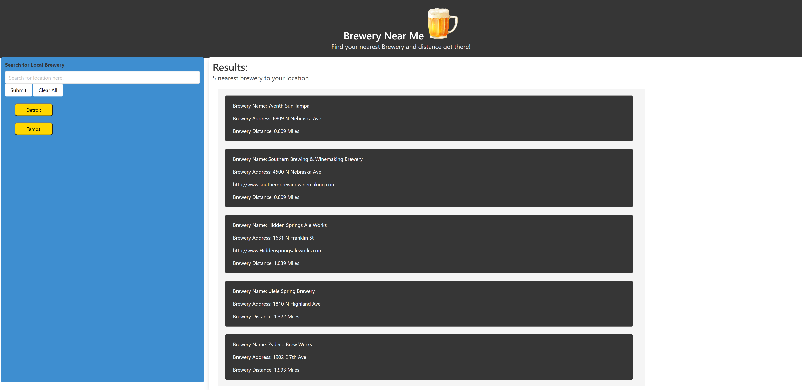

# Brewery Near Me

## Link to Application

https://tyomoto.github.io/potential-meme/ 

## Description
With Covid-19 restrictions being lifted this summer, we thought it would be a good idea to develop an application that helps people get out more!  Our application helps users find local breweries close to a location they input.  Whether you input your home address or a vacation destination, our app will display the five closest breweries to that location along with the distance based on Map Quest directions.

## User Story
As a user I want to view local brewery info so that I can try different local beers 

* Given I am a user looking for a local brewery:
*When I search for an address
* Then a list of the five closest breweries are displayed
* When I view each brewery
* Then the following brewery data is displayed
  * Brewery Name and Address
  * Website
  * Distance when using mapquest directions
* When I enter a location
* Then it appears in the search history bar and persits upon page refresh

## Technologies Used
* HTML
* CSS
* JavaScript
* jQuery
* Bulma

## Picture of Application

